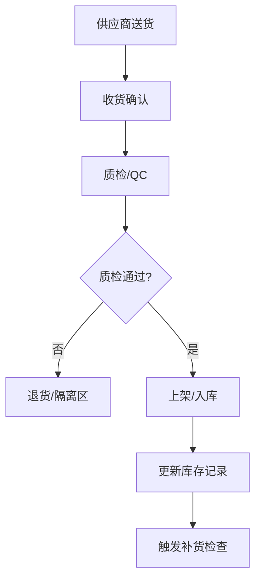
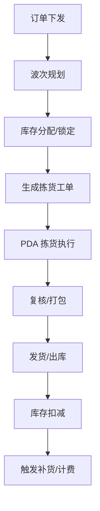
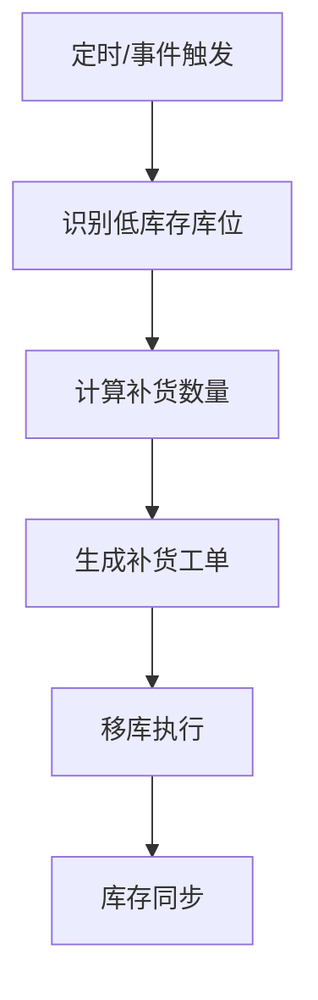

# WORKFLOWS.md

## 工作流与自动化流程设计

本文档描述系统的核心业务工作流、自动化流程、CI/CD 流水线及部署流程。

---

## 1. 核心业务工作流

### 1.1 入库流程


**关键节点**：
- 收货单创建 → 质检任务派发 → 上架工单生成 → 库存更新 → 事件发布

### 1.2 出库/拣货流程


**关键节点**：
- 波次策略计算 → 乐观锁库存预留 → 拣货路径优化 → 实时进度回写

### 1.3 库存补货流程


### 1.4 盘点流程
- 计划生成 → 盘点任务派发 → 实盘录入 → 差异分析 → 调整确认 → 审计日志

---

## 2. 自动化流程

| 流程 | 触发方式 | 核心逻辑 | 产出 |
|------|----------|----------|------|
| 库存同步 | 定时/事件 | 多源数据聚合、冲突解决 | 统一库存视图 |
| 补货调度 | 定时/库存阈值 | 需求预测、路径规划 | 补货工单批次 |
| 计费生成 | 定时/订单完成 | 策略计费、阶梯定价 | 计费明细/账单 |
| 报表生成 | 定时/手动 | 数据聚合、缓存刷新 | 管理驾驶舱数据 |
| 异常告警 | 实时事件 | 规则引擎匹配 | 钉钉/邮件/短信 |

---

## 3. CI/CD 流水线

### 3.1 Git 分支策略
| 分支 | 用途 | 保护规则 |
|------|------|----------|
| `main` | 生产发布 | PR + Review + CI 通过（2026-07-18 起在 GitHub 上真实生效，见下方说明） |
| `dev` | 集成测试 | PR + CI 通过（**未生效**：`.github/rulesets/dev-branch-protection.json` 对应的 ruleset 在 GitHub 上是 `enforcement: disabled`，且其 `required_status_checks` 引用的 job 名字 `security`/`lint-docs`/`docker-build`/`notify` 已不存在于当前 `ci.yml`，是历史遗留脱节，不在本次范围内修复） |
| `feature/*` | 功能开发 | 无 |
| `release/*` | 版本预发布 | PR + CI 通过 |
| `hotfix/*` | 紧急修复 | PR + Review |

> **`main` 分支保护已实际生效（2026-07-18）**：通过 GitHub Rulesets API 创建并启用 `main-branch-protection`（参考文件 `.github/rulesets/main-branch-protection.json`，已用 `gh api --method POST repos/{owner}/{repo}/rulesets` 实际调用生效，非仅文档记录）——要求 PR 合并前 `Lint & TypeCheck`/`Unit Tests`/`Build`/`CI Success` 四个 check 全部通过、禁止强推/删除 `main`、要求线性历史；核实返回的 `current_user_can_bypass` 为 `"never"`，即没有账号能绕过。这是对上一轮 ECC 治理试点第 4 项遗留的 HIGH 级发现（"CI 硬拦截只在 workflow 层面成立，GitHub 层面未生效"）的补齐。

#### 3.1.1 PR 提交流程（ECC 采纳，2026-07-18）
> 来源：`.claude/rules/ecc/common/git-workflow.md`。提交类型/scope 定义见 `docs/00-project/CONVENTIONS.md` §7，本节只补充操作步骤，不重复定义。

1. 分析完整提交历史（不要只看最新一次 commit）：`git log`
2. 用 `git diff <base-branch>...HEAD` 查看这个分支相对目标分支的**全部**变更，而不是相对上一个 commit
3. PR 描述包含变更摘要 + 测试计划（以 checklist 形式列出，未做的项保留未勾选状态，不要虚报为已完成）
4. 新分支首次推送用 `git push -u origin <branch>` 建立跟踪关系

### 3.2 CI 流水线（2026-07-18 更新：与 `.github/workflows/ci.yml` 实际内容对齐）
> **历史遗留问题**：此前本节描述的是一份从未落地的 5 阶段设计（含 ESLint/Prettier/Trivy/文档检查），与实际 `ci.yml` 一直存在脱节，ECC 治理试点冲突映射（`docs/06-agents/AGENTS.md` §8.3.2）核查时发现。以下改为如实描述当前 `ci.yml` 的 3 个 job，避免文档继续失真；扩充 lint 内容（真正接入 ESLint/Prettier）、新增 security/docs 阶段属于独立的后续工作，不在本次 ECC 治理试点范围内。

```yaml
# .github/workflows/ci.yml 实际阶段（2026-07-18 起 main/dev 均触发，lint 为硬门禁，不再 continue-on-error）
jobs:
  - lint: TypeScript 类型检查（`tsc --noEmit`，尚未接入 ESLint/Prettier）
  - test: Vitest 单元测试 + 覆盖率上报（依赖 lint 通过）
  - build: TypeScript 构建产物（依赖 lint + test 通过）
  - ci-success: 汇总门禁，lint/test/build 任一失败则整体失败
```

#### 3.2.1 数据库集成测试流水线（2026-07-20 新增，独立于 `ci.yml`）

`supabase/migrations`（DBA 团队交付的迁移脚本）已迁到独立私有仓库
[HiWmsSupabase](https://github.com/AaronLucas/HiWmsSupabase)（与本仓库零 git 关联，
无 submodule，详见 `docs/01-architecture/ADR/017-dba-migration-repo-split.md`）。
`.github/workflows/db-integration.yml` 负责实际跑通数据库这一侧：

```yaml
# .github/workflows/db-integration.yml（main/dev 双触发，独立 job，暂未加入 ci-success 硬门禁）
jobs:
  - db-integration:
      - checkout HiWms
      - checkout HiWmsSupabase（只读 Deploy Key，HIWMS_SUPABASE_DEPLOY_KEY secret，无过期时间）
      - cp HiWmsSupabase/supabase → ./supabase
      - supabase start（一次性本地 Docker Postgres）
      - supabase db reset（应用 001-008 迁移 + seed）
      - RUN_DB_CONCURRENCY_TESTS=true pnpm run test
      - supabase stop
```

首次上线，先观察稳定性（Docker 起停耗时、Deploy Key 权限等首跑风险），稳定后再评估
是否升级为 `ci-success` 的必过门禁项。本地开发同理需要 `./supabase/`（gitignore）时，
用 `bash scripts/sync-db-migrations.sh` 从 HiWmsSupabase 同步，不建立 git 层面关联。

### 3.3 CD 流水线
```yaml
# 部署阶段
stages:
  - staging: 自动部署至 Supabase Preview + Cloudflare Preview
  - production: Tag 触发 → 构建镜像 → 推送 Registry → Helm 升级
  - rollback: 手动触发 → Helm rollback → 健康检查
```

### 3.4 版本管理
- **语义化版本**：`MAJOR.MINOR.PATCH`
- **自动生成**：Conventional Commits → `standard-version` → CHANGELOG.md
- **发布流程**：`git tag v1.2.3` → GitHub Release → 自动部署

---

## 4. 部署流程

### 4.1 环境矩阵
| 环境 | 数据库 | Edge | 前端 | 用途 |
|------|--------|------|------|------|
| Local | Supabase Local | Wrangler Dev | Vite Dev | 开发调试 |
| Staging | Supabase Preview | Cloudflare Preview | Pages Preview | 集成测试/UAT |
| Production | Supabase Prod | Cloudflare Prod | Pages Prod | 正式服务 |

### 4.2 部署脚本
```bash
# 本地完整栈
docker-compose -f docker-compose.yml -f docker-compose.override.yml up -d

# Staging 部署
./scripts/deploy.sh staging

# 生产部署 (需 Tag)
./scripts/deploy.sh production v1.2.3

# 回滚
./scripts/rollback.sh production v1.2.2
```

### 4.3 蓝绿/金丝雀策略
- **金丝雀**：Ingress 权重 10% → 50% → 100%，指标异常自动回滚
- **蓝绿**：双套 Deployment，Service 切换，零停机

---

## 5. 工作流监控与治理

| 指标 | 采集方式 | 告警阈值 |
|------|----------|----------|
| 工作流成功率 | Prometheus Counter | < 99.5% |
| 任务平均耗时 | Histogram | > P99 30s |
| 租户级并发数 | Gauge | > 配额 80% |
| 死信队列堆积 | Gauge | > 100 条 |

---

## 6. 版本记录
| 版本 | 日期 | 变更内容 |
|------|------|----------|
| 1.0.0 | 2025-07-01 | 初始版本：核心业务流、CI/CD、部署策略 |
| 1.1.0 | 2025-07-07 | 新增项目特定暂停节点、Git 分支策略细化 |
| 1.2.0 | 2026-07-18 | 新增 §7.4 ECC 治理集成相关暂停节点，设计详见 `docs/06-agents/AGENTS.md` §8 |
| 1.3.0 | 2026-07-18 | ECC 治理试点第 4 项（转正）：新增 §3.1.1 PR 提交流程细则；§3.2 改为如实描述 `ci.yml` 实际 3 个 job（不再是从未落地的 5 阶段设计），并记录 `ci.yml` 已改为 main/dev 双触发 + 硬门禁 |
| 1.4.0 | 2026-07-18 | §3.1 补充 `main` 分支保护实际生效记录（GitHub Rulesets API，非仅文档），同时如实记录 `dev` 分支保护 ruleset 处于 disabled 状态且 job 名字已过期（历史遗留，未修复） |
| 1.5.0 | 2026-07-23 | 新增 §8「独立评审流程缺口」，登记对 `HiWmsSupabase` 迁移 013-015 复核发现的评审流程问题 |

---

## 7. 项目特定暂停节点（需人工确认）

### 7.1 数据库相关
- 执行任何 `supabase db push` / 迁移脚本前
- 修改 RLS 策略前
- 执行生产环境数据修复脚本前
- **涉及 `.sql` 文件的 PR，提交前必须按 `.readonly/unWMS_PR_Pre_Submission_Checklist_V1.md` 逐条自查并附验证证据**（2026-07-16 新增，DBA 团队根据真实踩坑经验制定，详见 `docs/00-project/CONVENTIONS.md` §8）

### 7.2 部署相关
- 创建 Release 标签前 (vX.Y.Z)
- 执行蓝绿/金丝雀切流前
- 修改 Kubernetes 资源配额前

### 7.3 架构变更
- 新增/删除微服务模块前
- 修改 Supabase Schema (表结构、函数、触发器) 前
- 变更认证/授权机制前

### 7.4 ECC 治理集成相关（2026-07-18 新增，设计详见 `docs/06-agents/AGENTS.md` §8）
- ~~执行"转正"提交前~~ **已于 2026-07-18 经人工确认后执行**（`.claude/rules/ecc/` 本身仍不提交；联动的 `CONVENTIONS.md`/`WORKFLOWS.md`/`ci.yml`/PR 模板改动已提交）

---

## 8. 独立评审流程缺口（2026-07-23，`HiWmsSupabase` 009-016 只读复核新增）

> `HiWmsSupabase` 由 DBA 团队独立维护，以下发现来自对该仓库迁移 013/014/015 设计文档
> 的只读复核，本节只做流程问题登记，不代表本仓库对该问题有直接处置权。

**问题**：`HiWmsSupabase` 的 `unWMS_PR_Pre_Submission_Checklist_V1.md` 第 12 条要求"触发
自动暂停节点的改动（函数契约变更/RLS/GRANT-REVOKE/部署顺序硬依赖）需要独立视角评审"。
但迁移 013、014、015 的设计文档均自曝：执行会话当时没有可用的子任务/独立评审工具，
部分 PR 以"草稿 + 待人工复核"状态提交；015 的设计文档甚至明确写着"第二轮独立评审
仍待安排"，本轮复核未能确认该轮评审是否真的发生过。

**影响**：这不是单次疏漏，而是三个连续迁移都遇到的同一个流程缺口——说明"独立评审"
这一步在当时的工具链下缺乏可靠的执行保障，而不是某个人偶然漏做。

**建议**（供本仓库与 `HiWmsSupabase` 协作时参考，具体流程改进由各自仓库自行决定）：
1. 在触发自动暂停节点的改动开始前，先确认独立评审所需的工具/会话可用，而不是做完
   再补
2. 对于已经存在"评审是否完成"疑问的历史 PR（013/014/015），建议 DBA 团队自行确认
   补一次事后独立评审，而不是默认历史记录已满足清单第 12 条
3. 本仓库自身的多 Agent 协作（`ecc:planner`/`ecc:database-reviewer`/`ecc:code-reviewer`
   等并行分析）如涉及触发 §7 暂停节点的改动，同样需要确认评审链路真实可用后再继续，
   避免重演同一类"自我声明但未验证"的评审记录

**跟踪位置**：`docs/03-database/DBA_ADDENDUM_REQUEST_2026-07-23.md`「上一轮追踪」表；
`docs/01-architecture/ARCHITECTURE.md` §11

### 8.1 本仓库自身的复现（2026-07-23，同一天内）

上面第 3 条建议写完不到一小时，本仓库的 Claude Code 会话就重演了同一个模式：
在完成 ADR-018（`fn_resolve_exception` 身份冒用修复，见 §11 P0 项）的代码改动后，
直接 `tsc --noEmit` + `vitest run` 通过就当作验证完毕，commit → push → 开 PR，
**跳过了 `/ecc:code-review`**——把类型检查/测试通过误当成了评审的替代品，且
即使想起来要评审，最初也是准备在写代码的同一个会话里"自己审自己"。经用户
指出后纠正为：另起一个独立的 `Agent`（`run_in_background: true`）跑
`ecc:code-reviewer` 对 PR 复核，而不是在原会话里自评。

**固化为规则**（不再只是观察记录）：

1. 本仓库任何代码改动（不限于 `.ts`，包含 `.sh`/`.sql` 等）在 push 前必须过
   一次 `/ecc:code-review`；`tsc`/`lint`/`vitest` 通过只代表"没有已知类型/测试
   回归"，**不代表**已完成评审，两者不能互相替代。
2. 评审必须是**独立会话**——用 `Agent` 工具起一个新的 `ecc:code-reviewer`
   （`run_in_background: true`），不能在编写代码的同一个会话/上下文里自评。
3. "自动推进提交模式"（本仓库根 `CLAUDE.md` 默认策略）、后台任务的"完成后自动
   commit/push/开 PR"约定，覆盖的是提交流程本身，**不构成跳过评审步骤的理由**。

**关联**：`.claude/rules/ecc/common/code-review.md`（已有"After writing or
modifying code"触发条件，本次是执行侧遗漏，不是规则缺失）；
`docs/00-project/CONVENTIONS.md`（建议后续补充引用本节）。
- ~~修改 `.github/workflows/ci.yml` 触发分支范围、移除 lint job 的 `continue-on-error` 前~~ **已于 2026-07-18 经人工确认后执行**：`ci.yml` 现已 `main`/`dev` 双触发，lint job 硬门禁
- 依据 ECC 规则回溯下调 `REPOSITORY_ROADMAP.md` 已标记"✅ 已完成"条目的状态前（需先书面告知受影响的开发团队成员，避免误判为倒退）——**已于 2026-07-18 经人工确认后执行**；**2026-07-19 Phase 5/6/7 已补齐基础集成测试，2026-07-20 经 ECC 多视角复核修正了文档状态不一致并识别出剩余缺口**，详见 `docs/00-project/ROADMAP.md` ECC 治理试点后续补齐工程、`docs/03-database/REPOSITORY_ROADMAP.md` §8「剩余缺口清单」