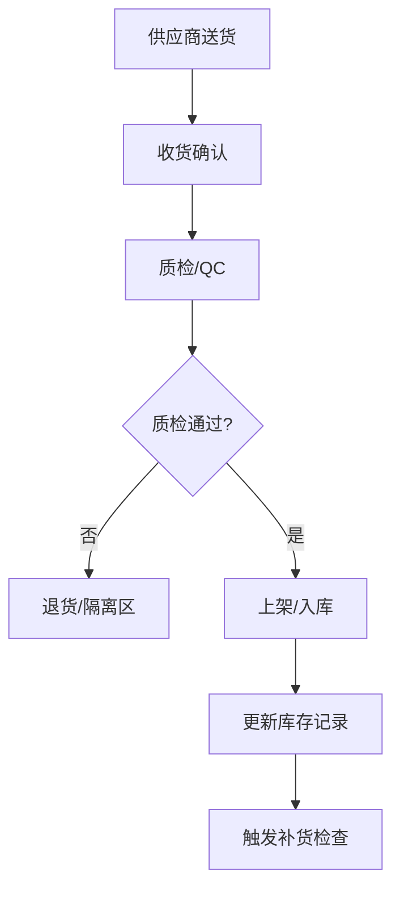
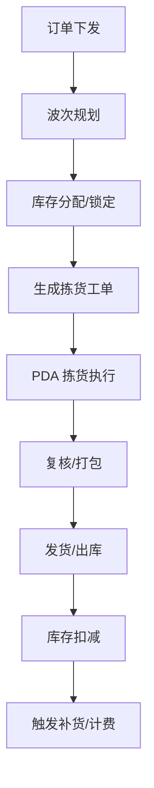
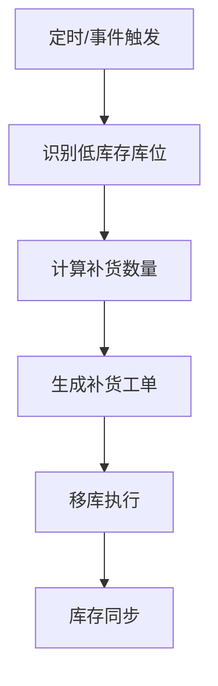

# WORKFLOWS.md

## 工作流与自动化流程设计

本文档描述系统的核心业务工作流、自动化流程、CI/CD 流水线及部署流程。

---

## 1. 核心业务工作流

### 1.1 入库流程


**关键节点**：
- 收货单创建 → 质检任务派发 → 上架工单生成 → 库存更新 → 事件发布

### 1.2 出库/拣货流程


**关键节点**：
- 波次策略计算 → 乐观锁库存预留 → 拣货路径优化 → 实时进度回写

### 1.3 库存补货流程


### 1.4 盘点流程
- 计划生成 → 盘点任务派发 → 实盘录入 → 差异分析 → 调整确认 → 审计日志

---

## 2. 自动化流程

| 流程 | 触发方式 | 核心逻辑 | 产出 |
|------|----------|----------|------|
| 库存同步 | 定时/事件 | 多源数据聚合、冲突解决 | 统一库存视图 |
| 补货调度 | 定时/库存阈值 | 需求预测、路径规划 | 补货工单批次 |
| 计费生成 | 定时/订单完成 | 策略计费、阶梯定价 | 计费明细/账单 |
| 报表生成 | 定时/手动 | 数据聚合、缓存刷新 | 管理驾驶舱数据 |
| 异常告警 | 实时事件 | 规则引擎匹配 | 钉钉/邮件/短信 |

---

## 3. CI/CD 流水线

### 3.1 Git 分支策略
| 分支 | 用途 | 保护规则 |
|------|------|----------|
| `main` | 生产发布 | PR + Review + CI 通过 |
| `dev` | 集成测试 | PR + CI 通过 |
| `feature/*` | 功能开发 | 无 |
| `release/*` | 版本预发布 | PR + CI 通过 |
| `hotfix/*` | 紧急修复 | PR + Review |

### 3.2 CI 流水线
```yaml
# .github/workflows/ci.yml 关键阶段
stages:
  - lint: ESLint + Prettier + TypeScript 类型检查
  - test: Vitest 单元测试 + 覆盖率阈值
  - build: TypeScript 构建产物 + 体积分析
  - security: npm audit + Trivy 容器扫描
  - docs: Markdown 链接检查 + API 文档生成
```

### 3.3 CD 流水线
```yaml
# 部署阶段
stages:
  - staging: 自动部署至 Supabase Preview + Cloudflare Preview
  - production: Tag 触发 → 构建镜像 → 推送 Registry → Helm 升级
  - rollback: 手动触发 → Helm rollback → 健康检查
```

### 3.4 版本管理
- **语义化版本**：`MAJOR.MINOR.PATCH`
- **自动生成**：Conventional Commits → `standard-version` → CHANGELOG.md
- **发布流程**：`git tag v1.2.3` → GitHub Release → 自动部署

---

## 4. 部署流程

### 4.1 环境矩阵
| 环境 | 数据库 | Edge | 前端 | 用途 |
|------|--------|------|------|------|
| Local | Supabase Local | Wrangler Dev | Vite Dev | 开发调试 |
| Staging | Supabase Preview | Cloudflare Preview | Pages Preview | 集成测试/UAT |
| Production | Supabase Prod | Cloudflare Prod | Pages Prod | 正式服务 |

### 4.2 部署脚本
```bash
# 本地完整栈
docker-compose -f docker-compose.yml -f docker-compose.override.yml up -d

# Staging 部署
./scripts/deploy.sh staging

# 生产部署 (需 Tag)
./scripts/deploy.sh production v1.2.3

# 回滚
./scripts/rollback.sh production v1.2.2
```

### 4.3 蓝绿/金丝雀策略
- **金丝雀**：Ingress 权重 10% → 50% → 100%，指标异常自动回滚
- **蓝绿**：双套 Deployment，Service 切换，零停机

---

## 5. 工作流监控与治理

| 指标 | 采集方式 | 告警阈值 |
|------|----------|----------|
| 工作流成功率 | Prometheus Counter | < 99.5% |
| 任务平均耗时 | Histogram | > P99 30s |
| 租户级并发数 | Gauge | > 配额 80% |
| 死信队列堆积 | Gauge | > 100 条 |

---

## 6. 版本记录
| 版本 | 日期 | 变更内容 |
|------|------|----------|
| 1.0.0 | 2025-07-01 | 初始版本：核心业务流、CI/CD、部署策略 |
| 1.1.0 | 2025-07-07 | 新增项目特定暂停节点、Git 分支策略细化 |

---

## 7. 项目特定暂停节点（需人工确认）

### 7.1 数据库相关
- 执行任何 `supabase db push` / 迁移脚本前
- 修改 RLS 策略前
- 执行生产环境数据修复脚本前

### 7.2 部署相关
- 创建 Release 标签前 (vX.Y.Z)
- 执行蓝绿/金丝雀切流前
- 修改 Kubernetes 资源配额前

### 7.3 架构变更
- 新增/删除微服务模块前
- 修改 Supabase Schema (表结构、函数、触发器) 前
- 变更认证/授权机制前